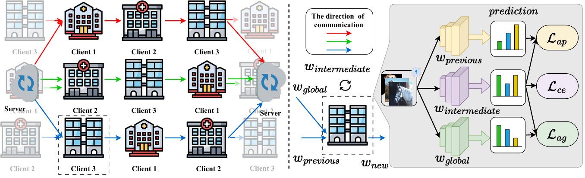
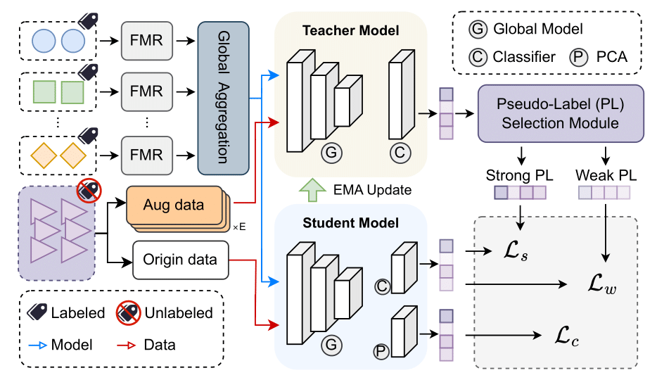
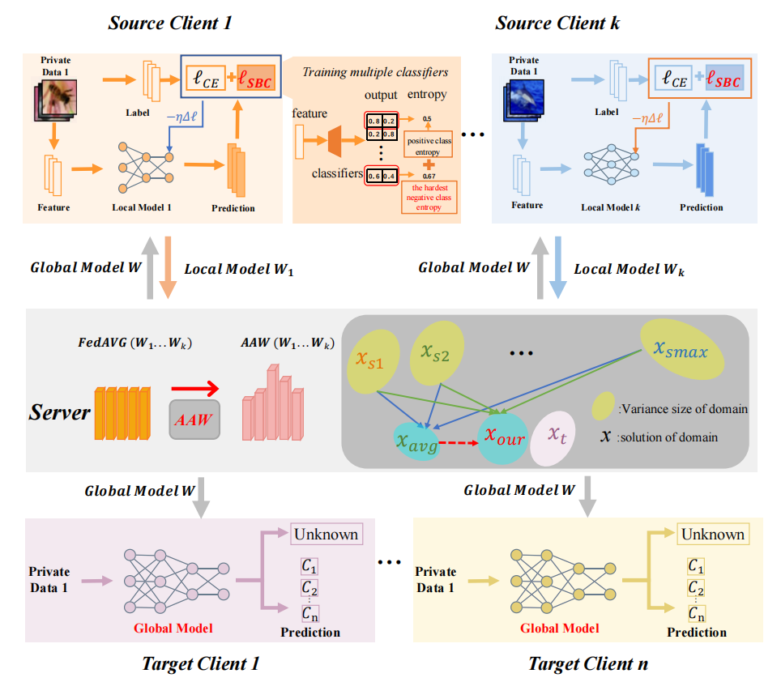

Hi,my name is Haoyuan Liang (Chinese: 梁浩源).I am a third-year Master's student at the School of Artificial Intelligence, Sun Yat-sen University.  
Before that, I obtained my Bachelor's degree from the School of Mechatronic Engineering and Automation,Shanghai University. I am very fortunate to be advised by [Prof. Juepeng Zheng](https://hail-alloy-af4.notion.site/Juepeng-Zheng-d3b70a4b409145139c91e55813cc80fa) at the [Intelligent Geospatial Computing and Sensing (IGCS) Lab](https://rssysu.github.io/).  

## 📖 Research
My research interests are broad, spanning several areas in artificial intelligence and large Language model training.  
In particular, I focus on the following topics:
- **⭐ Federated Learning**— including domain generalization, and personalized aggregation strategies.  
- **Multimodal Representation Learning** — exploring cross-modal alignment and knowledge fusion between vision, language, and audio modalities.  
- **Large Language Model Fine-Tuning** — with an emphasis on parameter-efficient adaptation and optimization of foundation models.  
- **Mixture-of-Experts (MoE) Architectures** — investigating modular routing, expert specialization, and distributed training efficiency.  
- **Foundation Models for Remote Sensing** — building large-scale geospatial pretraining frameworks for earth observation and environmental applications.

## ❤️ Hobby

Outside of research, I’m also a **fitness enthusiast** 🏋️‍♂️ and **basketball lover** 🏀.  
Feel free to reach out if you’d like to **work out together** or **play a game** — I’m always up for some healthy competition and training! 💪  

💬 In addition, I serve as an **emotional consultant**, and I’m always open to sharing insights or offering advice if you ever need to talk about relationships or personal growth. ❤️

📩 
If you have an exciting idea or would like to collaborate on my research topics, feel free to reach out via 
[email](mailto:lianghy68@mail2.sysu.edu.cn) or [WeChat](../images/wechat.png) — I’m always open to discussion and new collaborations.  
And beyond research, if you’d like to **chat about fitness or basketball**, or even **share and talk about life and relationships**, you’re more than welcome to connect with me! 🌟️

## 🔥 News
- 2025.09: 🎉🎉 One papers were accepted by NeurIPS'25 !
- 2025.08: 🎉🎉 One papers were accepted by EMNLP'25 !
- 2025.05: 🎉🎉 One papers were accepted by MM'25.
- 2025.03: 🎉🎉 One papers were accepted by ICME'25 !
- 2025.03: 🎉🎉 One paper was accepted by CVPR'25.
- 2024.12: 🎉🎉 One papers were accepted by AAAI'25 !

## 📝 Publications
<dl>
<dt>
</dt>
<dd><a href="https://neurips.cc/virtual/2025/poster/118827"><strong>	
SPFL: Sequential updates with Parallel aggregation for Enhanced Federated Learning under Category and Domain Shifts
</strong></a></dd>
<dd><strong>Haoyuan Liang</strong>, Shilei Cao, Guowen Li, Zhiyu Ye, Haohuan Fu, Juepeng Zheng.</dd>
<dd> The Thirty-Ninth Annual Conference on Neural Information Processing Systems (<strong>NeurIPS'25</strong>), 2025, <strong>CCF-A</strong></dd>
</dl>
 

***

<dl>
<dt>
</dt>
<dd><a href="https://ojs.aaai.org/index.php/AAAI/article/view/34053"><strong>	
TTA-FedDG: Leveraging Test-Time Adaptation to Address Federated Domain Generalization
</strong></a></dd>
<dd><strong>Haoyuan Liang</strong>, Xinyu Zhang, Shilei Cao, Guowen Li, Juepeng Zheng.</dd>
<dd>The Fortieth AAAI Conference on Artificial Intelligence (<strong>AAAI'2025</strong>), 2025, <strong>CCF-A</strong></dd>
</dl>
 
 

***

<dl>
<dt>
</dt>
<dd><a href="https://2025.ieeeicme.org/"><strong>	
Federated Open-Set Domain Generalization with Adaptive Adjustment Boundary and Weights
</strong></a></dd>
<dd><strong>Haoyuan Liang</strong>, Shilei Cao, Yushan Lai, Juepeng Zheng.</dd>
<dd> IEEE International Conference on Multimedia & Expo 2025 (<strong>ICME'25</strong>), 2025, <strong>CCF-B (Oral)</strong></dd>
</dl>
 
 
 

***

### Other Publication
1. Yushan Lai, Guowen Li, **Haoyuan Liang**, Juepeng Zheng, Zhiyu Ye. [ADU: Adaptive Detection of Unknown Categories in Black-Box Domain Adaptation](https://openaccess.thecvf.com/content/CVPR2025/html/Lai_ADU_Adaptive_Detection_of_Unknown_Categories_in_Black-Box_Domain_Adaptation_CVPR_2025_paper.html). The Thirty-Sixth IEEE/CVF Conference on Computer Vision and Pattern Recognition (CVPR'25), 2025 **(CCF-A)**
2. Zhiyu Ye, Guowen Li, **Haoyuan Liang**, Zixi Wang, Shilei Cao, Yushan Lai, Juepeng Zheng. Quantifying Samples with Invariance for Source-Free Class Incremental Domain Adaptation. the 33rd ACM International Conference on Multimedia (MM'25) **(CCF-A)**
3. Jielong Tang, Yang Yang, Jianxing Yu, Zhen-Xing Wang, **Haoyuan Liang**, Liang Yao, Jian Yin. UnCo: Uncertainty-Driven Collaborative Framework of Large and Small Models for Grounded Multimodal NER. The 2025 Conference on Empirical Methods in Natural Language Processing (EMNLP'25) **(CCF-B)**
   
***

## 🙂 Preprint
1. **Haoyuan Liang**, Zhiyu Ye, Jielong Tang, Yang Yang, Shilei Cao, Fei Hu, Guowen Li, Zhiwei Zhang, Haohuan Fu, Juepeng Zheng. UniFLoW: Universal Multi-Modal Federated LoRA Fine-Tuning Framework with Analytical Aggregation. Submitted to The Fourteenth International Conference on Learning Representations (ICLR'2026) **(CAAI-A)**
2. Juepeng Zheng, **Haoyuan Liang**, Shilei Cao, Qingmei Li, Yushan Lai, Guowen Li, Haohuan Fu. Federated Open-Set Domain Generalization with Adaptive Adjustment Boundary and Weights. Submitted to The IEEE Transactions on Neural Networks and Learning Systems (TNNLS) **(CCF-B)**

### 🏆 Honor & Award

#### 🎓 Graduate Period (Sun Yat-sen University)
- 2025.09 National Scholarship (国家奖学金), Sun Yat-sen University  
- 2025.09 First-Class Academic Scholarship (学业一等奖学金), Sun Yat-sen University   
- 2025.08 Huawei Innovation Cup – National Final, Research Excellence Award (鲲鹏创新应用大赛全国总决赛科研赛道银奖)  
- 2025.06 First Prize, 1st National Land Surface Resource Management GIS Application Competition (全国陆表资源管理地理信息技术应用竞赛一等奖)  

#### 🎓 Undergraduate Period (Shanghai University)
- 2023.06 Outstanding Graduate (优秀毕业生), Shanghai University  
- 2022.12 National Scholarship (国家奖学金), Shanghai University  
- 2022.08 MCM/ICM – M Award (美国大学生数学建模竞赛 M 奖)  
- 2021.12 National Second Prize, China Undergraduate Mathematical Contest in Modeling (全国大学生数学建模竞赛国家级二等奖) 
- 2021.11 Second Prize, National Advanced Manufacturing Product Innovation Competition (全国大学生先进制造技术与产品信息建模创新大赛国家二等奖) 
- 🏀 **Runner-up, Three-Point Shooting Contest (三分球大赛亚军)**, School of Mechatronic Engineering and Automation, Shanghai University  
  

## 💬 Academic Service
### Conference Committee Member
- Reviewer for ICLR'26
- Reviewer for ICME'25,MM'24
  
### Journal Reviewer
- Reviewer for Engineering Applications of Artificial Intelligence (EAAI)
